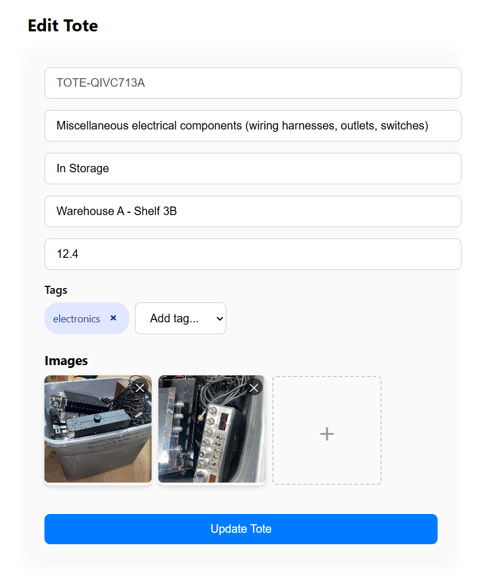
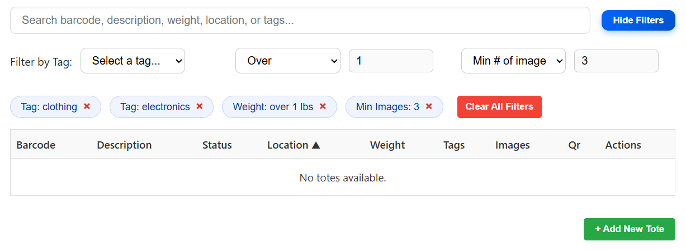
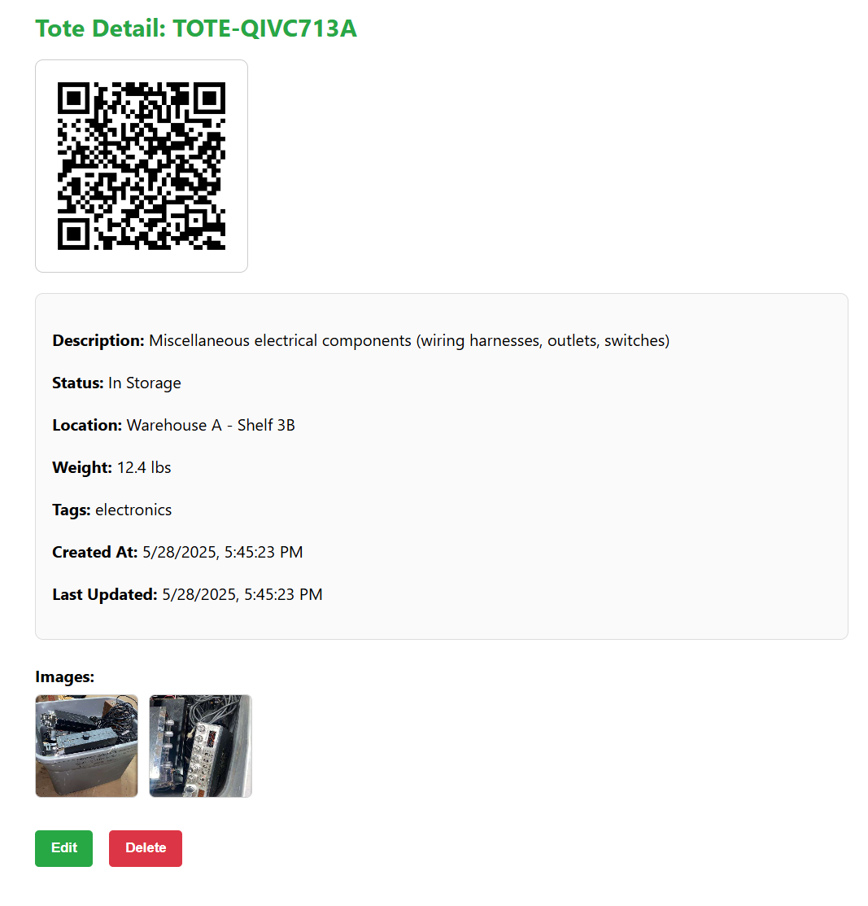
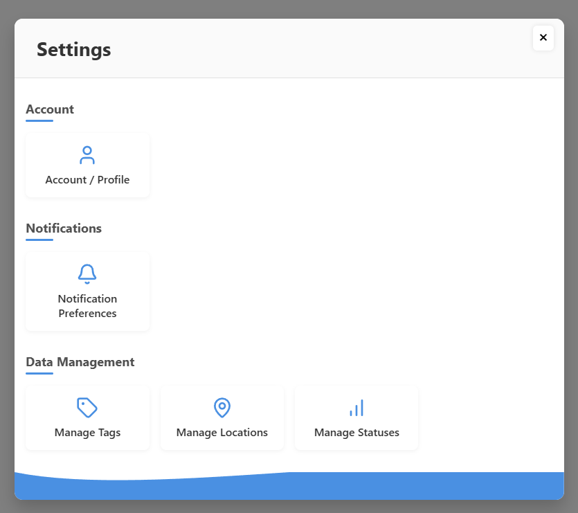

# Inventory Management Suite 

| <div align="center">
  <a href="https://your-demo-url.com" target="_blank" style="text-decoration:none; margin-right: 40px;">
    🚀 Demo
  </a>
  <a href="https://github.com/rangeroper/inventory_management_suite/issues/new" target="_blank" style="text-decoration:none;">
    🛠️ Contribute
  </a>
</div> |

A full-stack inventory management application built with FastAPI (backend) and React (frontend). It offers efficient storage control with powerful tagging, filtering, and fast item manipulation. Each tote is assigned a unique QR code for instant tracking (point your camera at the QR code and be redirected to the totes page), content visibility, and precise location identification at a glance.

Add photos of your tote contents to never forget what you’ve stored inside. Say goodbye to guessing where your totes are, what’s inside them, or worrying about perishables and electronics being misplaced or forgotten.

---

**Demo:** [https://qr-storage.onrender.com/](https://qr-storage.onrender.com/)

## 🚀 Getting Started

### Prerequisites

* Python 3.10.9
* Node.js 20.16.0
* npm 10.8.1
* MongoDB

---

## 🔧 Backend Setup (FastAPI)

Navigate to the backend folder:

```bash
cd backend
```

### Install dependencies:

Create a virtual environment (optional but recommended):

```bash
python -m venv env
source env/bin/activate  # On Windows: .\env\Scripts\activate
```

Install packages:

```bash
pip install -r requirements.txt
```

### Start the server:

```bash
uvicorn app.main:app --reload
```

By default, this runs at `http://127.0.0.1:8000`.

---

## 💻 Frontend Setup (React)

Navigate to the frontend folder:

```bash
cd frontend
```

### Install dependencies:

```bash
npm install
```

### Start the development server:

```bash
npm start
```

This will run the frontend on `http://localhost:3000`.

---

## ✨ Features

📦 **Create, edit, and delete inventory totes**  
_Easily manage your storage units with intuitive controls._



---

🏷️ **Assign and manage tags for easier classification**  
_Organize your totes with custom tags to simplify sorting and searching._

---

📍 **Assign and manage multiple storage locations** *(coming soon)*  
_Track items across different warehouses, units, or facilities._

---

🔖 **Assign and manage statuses** *(coming soon – free text for now)*  
_Use status labels to identify item condition, progress, or availability._

---

🔍 **Powerful search and filter tools**  
Search across barcode, description, weight, location, or tags.  
Filter by:
- Tag type
- Weight (exact, over, under)
- Image presence (no images, minimum number of images)



---

🧾 **View contents of individual totes**  
_See everything stored inside a tote — including quantity, images, and notes._



---

📍 **Track tote location details**  
_Store and view tote position by aisle, row, and shelf._

---

⚡ **Scan or generate QR codes for each tote**  
_Each tote gets a scannable QR code for fast access and updates._

---

💻 **Modern, responsive UI built with React**  
Works beautifully on both desktop and mobile devices.

⚙️ Unified Settings Page
Centralized management for profiles, accounts, tags, locations, statuses, and permissions




---

## 📦 API Endpoints

### Tote Routes

* `GET /totes` - Get all totes <br>
_Returns a JSON object with all totes._

* `GET /totes/{id}` - Get a tote by ID <br>
_Returns the tote matching the MongoDB ObjectId._

* `POST /totes` - Create a new tote <br>
_Accepts form data (barcode required, optional description, weight, tags, status, location, images).  Generates a QR code for the new tote._

* `PATCH /totes/{id}` - Edit tote (partial) <br>
_Accepts form data for description, weight, tags, status, location, existingImages (base64), and new image uploads.  Merges new images with existing ones and updates the tote._

* `DELETE /totes/{id}` - Delete tote <br>
_Deletes the tote matching the MongoDB ObjectId._

### Tag Routes

* `GET /tags` — List all tags <br>
_Returns a JSON object with all tags._

* `POST /tags` — Create a new tag <br>
_Returns the created tag object._

* `GET /tags/{tag_id}/affected-count` — Get number of totes using the tag <br>
_Returns the count of totes that have this tag applied._

* `PATCH /tags/{tag_id}` — Rename a tag <br>
_Renames the tag and updates all totes to replace old tag name with the new one._

* `DELETE /tags/{tag_id}` — Delete a tag <br>
_Deletes the tag and removes it from all totes referencing it._

### Location Routes

* `GET /locations` — List all locations <br>
_Returns a JSON object with all locations._

* `POST /locations` — Create a new location <br>
_Returns the created location object._

* `GET /locations/{location_id}/affected-count` — Get number of totes assigned to the location <br>
_Returns the count of totes that have this location assigned._

* `PATCH /locations/{location_id}` — Rename a location <br>
_Renames the location and updates all totes to replace the old location name with the new one._

* `DELETE /locations/{location_id}` — Delete a location <br>
_Deletes the location and removes it from all totes referencing it._

### Status Routes

* `GET /statuses` — List all statuses <br>
_Returns a JSON object with all statuses._

* `POST /statuses` — Create a new status <br>
_Returns the created status object._

* `GET /statuses/{status_id}/affected-count` — Get number of totes assigned this status <br> 
_Returns the count of totes that have this status applied._

* `PATCH /statuses/{status_id}` — Rename a status <br>
_Renames the status and updates all totes to replace the old status name with the new one._

* `DELETE /statuses/{status_id}` — Delete a status <br>
_Deletes the status and removes it from all totes referencing it._

### Batch Routes

* coming soon!

---

## 🗂 Folder Structure

```
inventory_management/
├── backend/           # FastAPI backend
├── frontend/          # React frontend
├── README.md
```

---

## ✅ Coming Soon

* Bulk and batch actions (apply changes across multiple totes or items)
* Manage multiple storage locations
* Support for multiple accounts and user profiles
* User authentication and login
* Role-based access control (e.g. admin, viewer, editor)
* View itemized contents within each tote (including quantity and estimated value)
* View itemized overview for each storage location (total totes, items, and estimated value)
* Global inventory dashboard showing summary across all locations (totes, items, estimated value)
* Global inventory dashboard showing summary across all locations (totes, items)
* Color-coded QR codes
* Flexible data export with permission-based access — export all data or filter by account, user profile, storage location, specific tote, or individual item
* AI - have gpt or claude or similar models auto-generate or recommend descriptions, estimated values, or any other assisted tasks

---

## 📄 License

MIT License.
