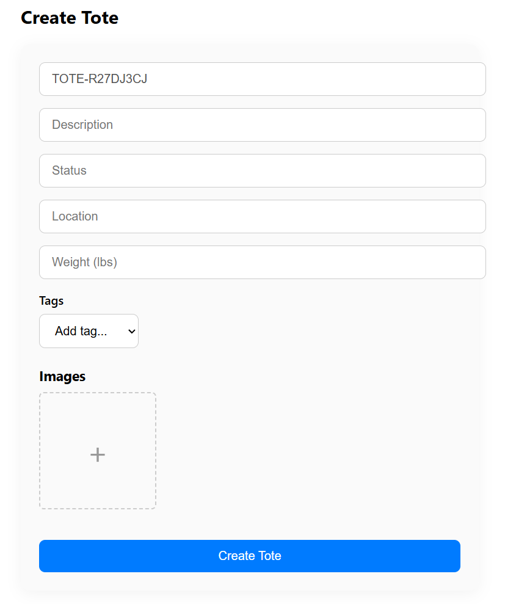
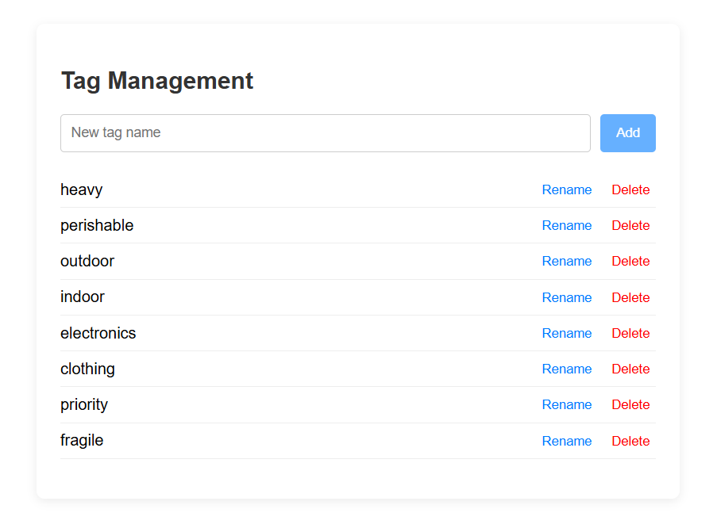
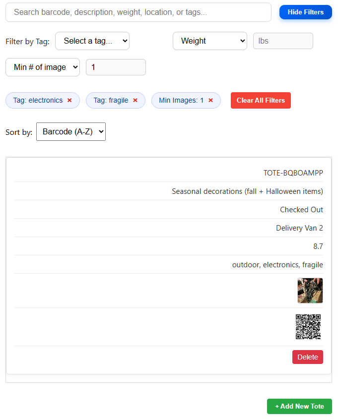

# Inventory Management Suite

A full-stack inventory management application built with FastAPI (backend) and React (frontend). It offers efficient storage control with powerful tagging, filtering, and fast item manipulation. Each tote is assigned a unique QR code for instant tracking (point your camera at the QR code and be redirected to the totes page), content visibility, and precise location identification at a glance.

Add photos of your tote contents to never forget what you’ve stored inside. Say goodbye to guessing where your totes are, what’s inside them, or worrying about perishables and electronics being misplaced or forgotten.

---

**Demo:** [https://qr-storage.onrender.com/](https://qr-storage.onrender.com/)

## 🚀 Getting Started

### Prerequisites

* Python 3.10.9
* Node.js 20.16.0
* npm 10.8.1
* MongoDB

---

## 🔧 Backend Setup (FastAPI)

Navigate to the backend folder:

```bash
cd backend
```

### Install dependencies:

Create a virtual environment (optional but recommended):

```bash
python -m venv env
source env/bin/activate  # On Windows: .\env\Scripts\activate
```

Install packages:

```bash
pip install -r requirements.txt
```

### Start the server:

```bash
uvicorn app.main:app --reload
```

By default, this runs at `http://127.0.0.1:8000`.

---

## 💻 Frontend Setup (React)

Navigate to the frontend folder:

```bash
cd frontend
```

### Install dependencies:

```bash
npm install
```

### Start the development server:

```bash
npm start
```

This will run the frontend on `http://localhost:3000`.

---

## ✨ Features

📦 Create, edit, and delete inventory totes



🏷️ Assign and manage tags for easier classification 



📍 Assign and manage multiple storage locations for precise tracking (coming soon)

🔖 Assign and manage statuses to track progress, status, or condition (coming soon - free text for now)

🔍  Powerful search and filter: Quickly find totes by searching barcode, description, weight, location, or tags. Refine results by selecting specific tags, filtering by weight (exact, above, or below a threshold), or filtering by image availability (no images or minimum number of images).


🧾 View contents of individual totes


📍 Track tote location (storage location, aisle, row, shelf, etc.)

⚡ Generate and scan QR codes for each tote to instantly locate and identify them

💻 Responsive, modern UI built with React


---

## 📦 API Endpoints

### Tote Routes

* `GET /totes` - Get all totes
* `GET /totes/{id}` - Get a tote by ID
* `POST /totes` - Create a new tote
* `PATCH /totes/{id}` - Edit tote (partial)
* `DELETE /totes/{id}` - Delete tote

### Tag Routes

* `GET /tags` - Get all tags
* `POST /tags` - Create a tag
* `DELETE /tags/{id}` - Delete a tag

### Batch Routes
* coming soon!

---

## 🗂 Folder Structure

```
inventory_management/
├── backend/           # FastAPI backend
├── frontend/          # React frontend
├── README.md
```

---

## ✅ Coming Soon

* Bulk and batch actions (apply changes across multiple totes or items)
* Manage multiple storage locations
* Support for multiple accounts and user profiles
* User authentication and login
* Role-based access control (e.g. admin, viewer, editor)
* View itemized contents within each tote (including quantity and estimated value)
* View itemized overview for each storage location (total totes, items, and estimated value)
* Global inventory dashboard showing summary across all locations (totes, items, estimated value)
* Global inventory dashboard showing summary across all locations (totes, items)
* Color-coded QR codes
* Flexible data export with permission-based access — export all data or filter by account, user profile, storage location, specific tote, or individual item
* Unified Settings Page — manage tags, locations, and statuses in one place, along with account and profile configuration settings
* AI - have gpt or claude or similar models auto-generate or recommend descriptions, estimated values, or any other assisted tasks

---

## 📄 License

MIT License.
